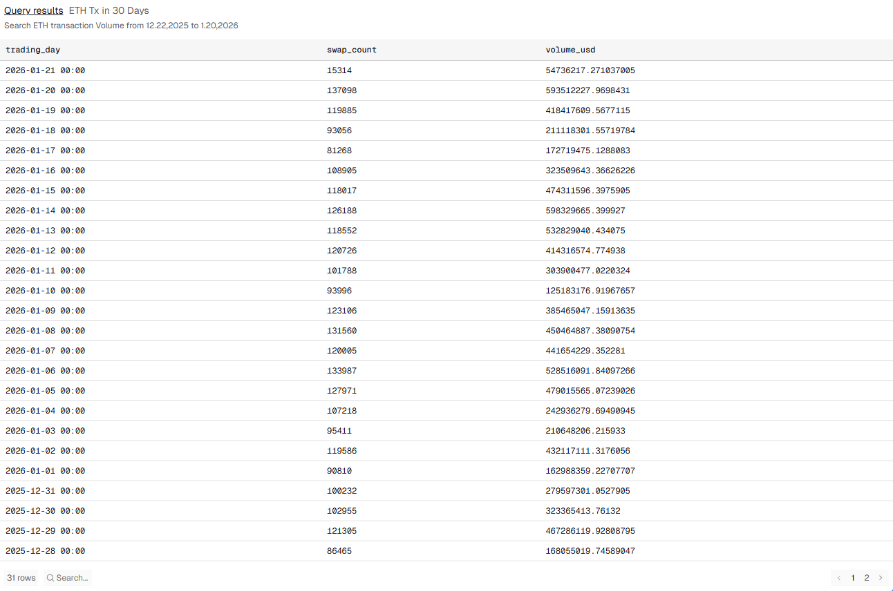
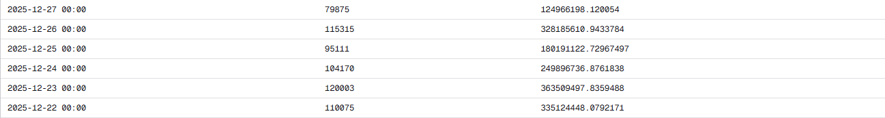
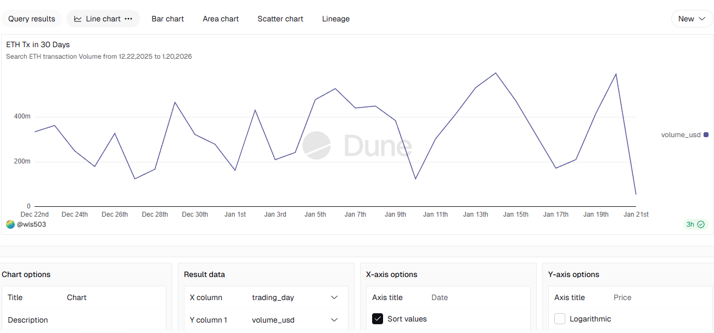
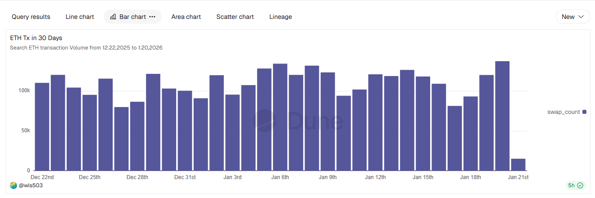
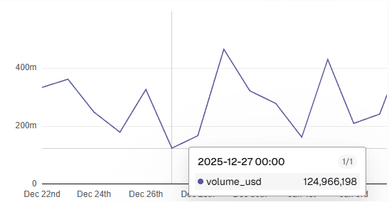
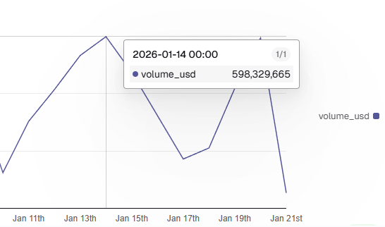

# Uniswap V3 30-Day Transaction Volume Analysis Report

## Executive Summary

Based on Dune Analytics on-chain data statistics, this report analyzes Uniswap V3's trading activity from December 22, 2025 to January 20, 2026 (excluding January 21). The data shows transaction volume displaying a "low-high-low-high" pattern, with market activity being comparatively active and exhibiting evident high-low fluctuations.

**Data Source**: [Dune Analytics - Uniswap V3 Analysis](https://dune.com/queries/6573332/10383827?utm_source=share&utm_medium=copy&utm_campaign=visualization)

---

## I. Core Data Metrics

| Metric                             | Value           |
| ---------------------------------- | --------------- |
| **Highest Trading Volume**         | $598.33 Million |
| **Highest Volume Date**            | 2026-01-14      |
| **Lowest Trading Volume**          | $124.97 Million |
| **Lowest Volume Date**             | 2025-12-27      |
| **Growth Magnitude**               | **379%**        |
| **Average Daily Trading Volume**   | $358 Million    |
| **Median Trading Volume**          | $353 Million    |
| **Standard Deviation**             | $147 Million    |
| **Total Trading Volume (30 days)** | $10.74 Billion  |

**Key Findings**: Peak volume is **4.79 times** the lowest volume, indicating significant volatility.

### Data Source Details




**SQL Query Used**:

```sql
SELECT
  DATE_TRUNC('day', block_time) as trading_day,
  COUNT(*) as swap_count,
  SUM(amount_usd) as volume_usd
FROM dex."trades"
WHERE blockchain = 'ethereum'
  AND project = 'uniswap'
  AND version = '3'
  AND block_time >= NOW() - interval '30' day
GROUP BY DATE_TRUNC('day', block_time)
ORDER BY trading_day DESC
```

---

## II. 30-Day Transaction Volume Trend Analysis

### Visual Analysis



The line chart reveals the volume trajectory across the 30-day period. Trading volume exhibits distinct cyclical patterns with two major peaks (Jan 6 and Jan 14-15) separated by correction phases.



The bar chart displays daily transaction counts, showing relatively consistent participation levels (90k-130k trades daily) despite volume fluctuations.

### Phase 1 (Dec 22 - Dec 31): Dormant Period

- **Characteristics**: Trading volume at low levels, ranging between $125M - $467M
- **Daily Average**: $282 Million
- **Peak**: Dec 29 at $467M
- **Trough**: Dec 27 at $125M (lowest point in entire period)

### Phase 2 (Jan 1 - Jan 9): Recovery Period

- **Characteristics**: Volume increases from trough with volatility
- **Daily Average**: $370.42 Million (+31.35% vs Phase 1)
- **Peak**: Jan 6 at $528.5M
- **Trough**: Jan 1 at $163M

### Phase 3 (Jan 10 - Jan 14): High-Value Period

- **Characteristics**: Trading volume reaches elevated levels, consistently above $400M
- **Daily Average**: $394.91 Million
- **Peak**: Jan 14 at $598.33M (30-day record high)
- **Trough**: Jan 10 at $125.18M
- **Data Point**: Jan 14 is the highest point in the entire 30-day cycle

### Phase 4 (Jan 15 - Jan 20): Correction Period

- **Characteristics**: Volume declines from peak but maintains relatively high levels
- **Daily Average**: $365.59 Million
- **Peak**: Jan 20 at $593.51M
- **Trough**: Jan 17 at $172.72M

---

## III. Data Analysis of Key Points

### Point 1: January 10, 2026 - Volume at $125 Million



**Data Characteristics**:

- Trading volume: $125.18M
- Represents a **67% decline** compared to Jan 9 ($385.47M)
- Swap count: 93,996 transactions on Jan 10
- Swap count on Jan 9: 123,106 transactions (24% difference)
- This is the lowest volume point in the entire 30-day period

**Observations**:

- January 10 was a Friday
- Jan 11 volume: $303.90M (recovery of 122% from Jan 10)
- Both volume and swap count declined proportionally

---

### Point 2: January 14, 2026 - Volume Peak at $598 Million



**Data Characteristics**:

- Trading volume: $598.33M (highest in 30-day period)
- Swap count: 126,188 transactions (highest in 30-day period)
- Jan 13 volume: $532.83M
- Represents a **146% increase** from Jan 13
- Consecutive peaks: Jan 13 ($532M) and Jan 14 ($598M)

**Observations**:

- January 14 was a Tuesday
- Following this peak, volume declines to $474M on Jan 15
- Further decline to $172M on Jan 17

---

### Point 3: December 27, 2025 - Volume at $125 Million

**Data Characteristics**:

- Trading volume: $124.97M
- Swap count: 79,875 transactions (lowest in entire period)
- Dec 26 volume: $328.19M
- Represents a **62% decline** from Dec 26
- Tied with Jan 10 as joint lowest volume points

**Observations**:

- December 27 was a Thursday
- Dec 28 volume: $168.06M
- Dec 29 volume: $467.29M
- Recovery trajectory: Dec 27 → Dec 28 → Dec 29 shows progressive increase

---

## IV. Data Patterns Observed

From **data distribution** observation:

| Pattern                                    | Observation                                                             |
| ------------------------------------------ | ----------------------------------------------------------------------- |
| **Weekend Trading Volume**                 | Varies; Dec 27 (Thursday) = $125M; Jan 10 (Friday) = $125M              |
| **Weekday Trading Volume**                 | Range from $163M to $598M                                               |
| **Early Month vs Mid-Month**               | December range ($125M-$364M) vs January range ($125M-$598M)             |
| **Transaction Count & Volume Correlation** | Both metrics move in same direction; high counts accompany high volumes |

---

## V. Data Volatility Metrics

- **Standard Deviation**: $147 Million (41% of daily average)
- **Range**: $125M to $598M (difference of $473M)
- **Coefficient of Variation**: 0.41

**Notable Volatility Events**:

- Jan 9 to Jan 10: 67% single-day decline
- Jan 13 to Jan 14: 146% single-day increase
- Dec 26 to Dec 27: 62% single-day decline

---

## VI. Data Quality Statement

- **Data Source**: [Dune Analytics](https://dune.com/queries/6573332/?utm_source=share&utm_medium=copy&utm_campaign=query) / Uniswap V3 on-chain data
- **Sampling Period**: Dec 22, 2025 - Jan 20, 2026 (30 days, excluding Jan 21)
- **Data Completeness**: 30 rows of complete data, no missing values
- **Metric Calculation**: Based on total trading amount settled in USD (volume_usd)
- **Unit**: All amounts in US Dollars (USD)
- **Query Frequency**: Daily batch processing at 00:00 UTC

---

## Conclusion

Uniswap V3 transaction volume over the 30-day period (Dec 22, 2025 - Jan 20, 2026) shows:

- Lowest volume: $124.97M (Dec 27, Jan 10)
- Highest volume: $598.33M (Jan 14)
- Overall growth: 379% from lowest to highest
- Average daily volume: $358M
- High volatility with standard deviation of $147M

The data exhibits cyclical patterns with two major peaks and multiple correction phases.
